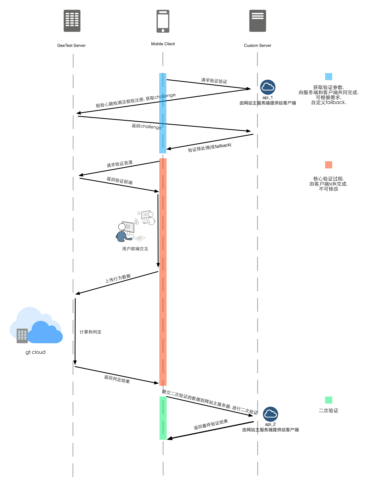
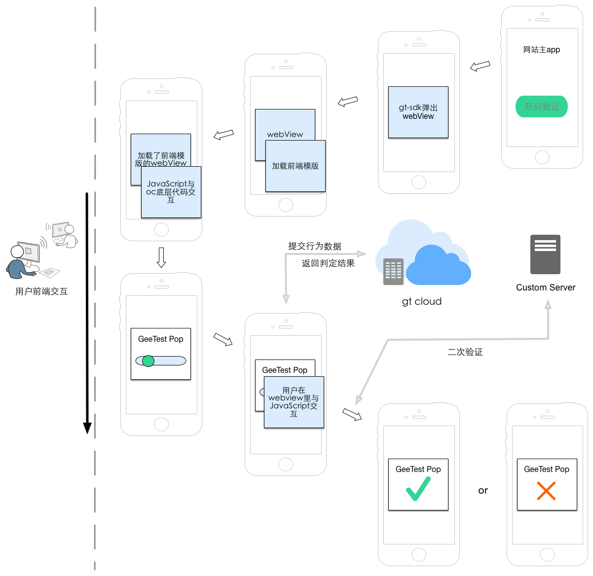

====================================
Android-Dev
====================================

.. contents:: 目录

概述
================================================

1. 基于安卓4.0, 使用开发工具为android studio 2.0.0, 直接导入本目录即可看到app demo以及sdk的源码
2. 极验验证android sdk 通过对安卓的包装，方便安卓工程师集成极验验证的验证前端。
3. 演示项目提供了用户服务器的预处理以及完整的一次验证，并将客户端验证结果向示例的客户服务器上发起二次验证的完整通讯过程。
4. sdk 包括 GtDialog, GTWebview, Geetest, DimenTool三个文件. 
5. 不依赖任何第三方库.
6. android端sdk必须与服务器部署代码配套使用，否者无法完成二次验证。`服务器部署代码请移步官网安装文档   <http://www.geetest.com>`__
7. 不支持android 2.3的原因: JavascriptInterface 在2.3导致webview 崩溃, 尝试过解决但请原谅我门的方案并没有效果 `相关资料   <https://code.google.com/p/android/issues/detail?id=12987>`__
8. 欢迎contributions.

验证主要分为三个部分：
	1.	从网站主服务器获取所需的验证数据(id,challenge,success)
	2.	核心验证过程
	3.	根据验证回调数据进行二次验证

Android SDK 主要完成过程:
	1.	给出默认的failback机制获取所需的验证数据(网站主可以根据自己的需求自己完成此过程)
	2.	完成核心验证过程
	3.	二次验证不是由sdk完成，而是网站主自己根据demo的逻辑来完成这一块的部署

权限需求
=======================================
请在app/.../AndroidManifest.xml中添加以下权限

.. code::

	<uses-permission android:name="android.permission.INTERNET" />
   	<uses-permission android:name="android.permission.ACCESS_WIFI_STATE" />
	<uses-permission android:name="android.permission.ACCESS_NETWORK_STATE" />
	<uses-permission android:name="android.permission.CHANGE_WIFI_STATE" />
	<uses-permission android:name="android.permission.READ_PHONE_STATE" />

Maven
=======================================
如需使用maven管理依赖, 需要在你的主工程文件里加入一下配置

**maven version => gtapp-android-sdk**
-------------------------------------------------------------------

1. v1.0.0 **=>** 2.16.12.15.1

.. code::
	
	allprojects {
		repositories {
			jcenter()
			mavenLocal()//本地
			maven { url 'https://jitpack.io' }
		}
	}

以及

.. code::

	dependencies {
	        compile 'com.github.GeeTeam:gtapp-android:<maven version>'//例如v1.0.0
	}

通讯流程图
=======================================

技术实现展示
=======================================

SDK的模块
=======================================

网络请求模块Geetest
-------------------------------------------------------------------

1. 构建Geetest模块

@Param String captchaURL 网站主配置用语请求验证参数的接口: api_1

@Param String validateURL 网站主配置用语二次验证的接口: api_2

.. code::

	public Geetest(String captchaURL, String validateURL);

2. 返回服务器状态

@param JSONObject 验证初始化参数的JSON对象

.. code::
	
	public JSONObject checkServer();

3. 提交网络超时回调

设置监听对象

.. code::

	public void setGeetestListener(GeetestListener listener);

回调函数

.. code::

	public interface GeetestListener {
        void readContentTimeout();
        void submitPostDataTimeout();
        void receiveInvalidParameters();
    }

4. 获取用于验证的id

@return String 32位验证id

.. code::

	public String getGt();

5. 获取用于验证的challenge

@return String 32位验证challenge

.. code::

	public String getChallenge();

6. 获取网站主服务器返回的验证服务可用状态

@return boolean 验证服务的状态(true可用/false不可用)

.. code::
	
	public boolean getSuccess();

7. 验证超时配置

@param int timeout 以毫秒为单位(ms)，默认10000ms

.. code::
	
	public void setTimeout(int timeout);

8. 验证完成提交数据进行二次验证

@param Map<String, String> params 二次验证的参数

@param String encode 编码格式

.. code::

	public String submitPostData(Map<String, String> params, String encode);

验证对话模块GtDialog
-------------------------------------------------------------------

1. 构建GtDialog

@param Context context 上下文

@param JSONObject params 包含验证初始化参数的JSON对象

.. code::

	public GtDialog (Context context, JSONObject params);

2. JavascriptInterface回调接口

设置监听对象

.. code::
	
	public void setGtListener(GtListener listener);

回调接口

.. code::

	public interface GtListener {

        //通知native验证已准备完毕
        void gtCallReady(Boolean status); // true准备完成/false 因超时未准备完成

        //通知native关闭验证
        void closeGt();

        //通知native验证结果，并准备二次验证
        void gtResult(boolean success, String result);

        //执行极验的javascript文件报错
        void gtError();
    }

3. 设置webview超时时长

@param int timeout 超时时长, 以毫秒为单位. 默认10000ms.

.. code::
	
	public void setTimeout(int timeout);

4. 设置验证展示语种

支持简体中文"zh-cn", 香港繁体"zh-hk", 台湾繁体"zh-tw", 韩语"ko-kr", 日语"ja-jp", 英语"en-us". 默认"zh-cn".

@param String lang 支持的语种简码

.. code::

	public void setLanguage(String lang);

5. 终止webview加载

.. code::
	
	public void stopLoading();

6. 调试模式

@param Boolean debug 是否使用调试模式

.. code::

	public void setDebug(Boolean debug);

(完)
